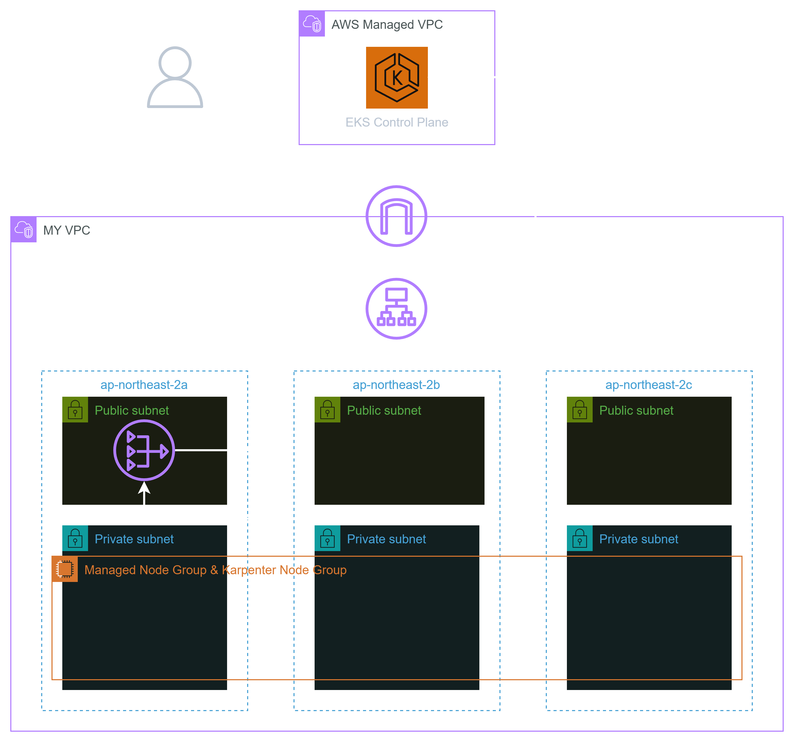
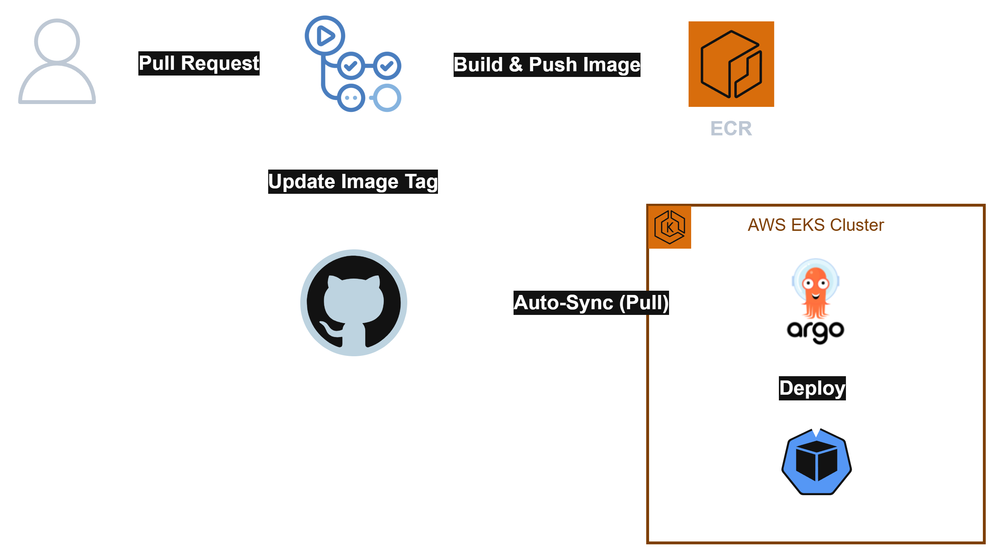

# EKS 인프라 구축 및 GitOps 기반 환경 설계 프로젝트

AWS EKS 기반 인프라를 Terraform으로 구축하고, ArgoCD 기반 GitOps로 Addon과 애플리케이션을 배포하며, KEDA+Karpenter를 활용하여 SQS 큐 기반 오토스케일링을 검증한 프로젝트입니다.

## Repository Structure
```text
.
├── terraform/                        # Terraform EKS/VPC Module 및 환경별 분리
│   ├── modules/
│   │   ├── eks/
│   │   └── vpc/
│   └── envs/
│       ├── global/                   # ECR, KMS, SSM 등 환경에 의존하지 않는 리소스
│       ├── dev/
│       │   ├── eks/
│       │   ├── vpc/
│       │   ├── apps/
│       │   └── acm/
│       └── prod/
│
├── gitops/                            # ArgoCD Application 기반 단계별 배포 구조
│   ├── charts/                        # 데모 앱 헬름 차트
│   └── envs/
│       ├── dev/
│       │   ├── root-application/      # App of Apps 구조의 Root Application
│       │   ├── primary-application/   # CRD를 제공하거나 Custom Resource를 의존하지 않는 Addon
│       │   ├── secondary-application/ # Custom Resource을 포함한 Manifests, Custom Resource 의존 Addon
│       │   └── service-application/   # 서비스 Application
│       └── prod/
│
├── helm-values/                       # 환경별 Helm values 구성
│   ├── dev/
│   └── prod/
│
├── init-manifests/                    # 운영 전 클러스터에 필요한 Custom Resource 및 manifests
│   ├── dev/
│   └── prod/
│
└── eks-demo/                          # 스프링부트 데모 앱
```
## EKS Architecture (Single NAT Gateway)


## GitOps Structure
